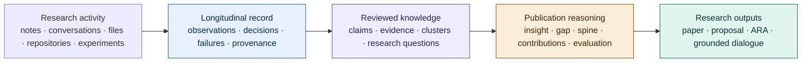

<p align="center">
  
</p>

# RKA Core — Research Knowledge Agent

[](https://github.com/rka-project/rka-core/actions/workflows/pytest.yml)
[](LICENSE)
[](https://doi.org/10.2139/ssrn.7396118)

**A local-first research operating system for turning day-to-day research activity into durable, auditable knowledge.**

AI-assisted research produces valuable observations, experiments, decisions, and failures, but that reasoning is often scattered across conversations, repositories, notes, and terminal logs. RKA maintains a persistent, provenance-aware research record and helps researchers progressively transform it into claims, evidence clusters, research questions, and defensible publication structures.

With RKA, researchers can:

- resume long-running projects without reconstructing prior reasoning;
- preserve why decisions were made and what evidence supports them;
- separate tentative observations from reviewed claims;
- supervise AI collaborators through explicit missions and decision gates;
- expose auditable research records to downstream tools; and
- support multiple research outputs from the same knowledge substrate without
  coupling those tools to Core.

RKA is built for research workflows in computer science, AI, cybersecurity, IoT, and cyber-physical systems. The core is usable today; the interactive manuscript workbench and Agent-Native Research Artifact interoperability described below are active roadmap directions.


## Why RKA exists

Research is not a sequence of isolated prompts. It is a long-running process of forming questions, trying approaches, collecting evidence, revising assumptions, and deciding what the evidence supports.

Most AI tools preserve only fragments of that process. Conversation history remembers what was said but not necessarily what remains valid. Vector databases retrieve similar passages but do not explain why a decision was made. Task agents execute work but often discard the reasoning, alternatives, and failed branches that make results interpretable.

RKA treats the research record itself as durable infrastructure.



RKA Core owns the early stages of this pipeline: durable research records,
retrieval, provenance, and reviewed knowledge. Manuscript development is an
independent downstream capability in `rka-writer`; it is not activated by the
Core distribution.

## How it works

RKA coordinates three roles around one shared, typed knowledge base:

- **Researcher** — frames the problem, contributes domain knowledge, ratifies consequential decisions, and retains final authority.
- **Brain** — retrieves context, synthesizes evidence, maintains claims and research questions, proposes options, and keeps interpretations current.
- **Executor** — performs bounded implementation or experimental missions, records findings, and raises checkpoints when assumptions or scope require review.
- **RKA** — stores the shared record, provenance graph, lifecycle state, and auditable handoffs between them.

The roles are architectural responsibilities, not requirements to use one particular model. RKA exposes its capabilities through MCP and REST. The reference workflows are currently tested most extensively with Claude Desktop and Claude Code; Codex and other local clients use STDIO MCP. Remote HTTP MCP and ChatGPT connectors are deferred in Core 3.0.0; see [the access boundary](docs/REMOTE_ACCESS.md).

### Progressive crystallization

RKA does not require every raw note to become a formal conclusion immediately. Knowledge matures in stages:

```mermaid
flowchart LR
    Journal["Journal<br/>observations · procedures · directives"]
    Candidates["Interpretation candidates<br/>source locator · uncertainty · falsifier"]
    Claims["Claims<br/>typed assertions with source spans"]
    Scope["Claim scope versions<br/>conditions · extension policy · falsifier"]
    Clusters["Evidence clusters<br/>related claims + synthesis"]
    Questions["Research map<br/>questions · gaps · contradictions"]
    Writing["Claim spine<br/>argument · contribution · evaluation"]

    Journal --> Candidates --> Claims --> Scope --> Clusters --> Questions --> Writing
```



Raw records remain available even when later interpretations change. Candidate
interpretations must be reviewed explicitly before promotion; they can be
deferred, rejected, merged, or classified without silently becoming scientific
claims. Derived claims and clusters can be reviewed, superseded, or rebuilt
without rewriting history.

Each canonical claim has a separate, immutable applicability contract. Scope
reviews record typed conditions, uncertainty, allowed and prohibited
extensions, and falsifiers. Missing or stale scope stays visible rather than
being inferred, and manuscript admission also continues to check grounding,
scientific evidence status, contradictions, and freshness independently.

### Provenance by construction

RKA connects literature, decisions, missions, findings, claims, and later decisions through typed relationships. A researcher can ask not only “What do we currently believe?” but also:

- Which observations support this claim?
- Which decision caused this experiment to be run?
- What changed after an assumption was invalidated?
- Which manuscript contribution still lacks sufficient evidence?
- What did the project believe at an earlier point in time?

### Researcher-controlled agency

AI collaborators may propose interpretations and execute approved work, but consequential commitments remain visible. Confirmation briefs, checkpoints, decision records, validation gates, and reversible supersession keep the researcher in control without forcing them to reconstruct every agent action.

## What RKA is—and is not

RKA is not a replacement for a reference manager, a generic retrieval database, or a paper generator layered directly on top of chat history.

It combines four concerns that are usually separated:

| Concern | RKA's role |
|---|---|
| **Continuity** | Preserve research activity across sessions, tools, and collaborators. |
| **Epistemic structure** | Distinguish observations, assumptions, hypotheses, results, and reviewed claims. |
| **Control** | Record decisions, delegate bounded missions, and escalate uncertainty. |
| **Publication grounding** | Build arguments from traceable claims and evidence rather than reconstructing provenance after writing. |

Zotero, repositories, notebooks, and experimental platforms remain important sources. RKA links and interprets their outputs rather than attempting to replace them.

## What is available today

- **Persistent, multi-project research records** for journals, literature, decisions, missions, reports, checkpoints, and artifacts.
- **Interpretation staging** with exact source locators, uncertainty, falsifiers, immutable review history, and explicit promotion or revocation.
- **Canonical claim-scope contracts** with immutable revisions, typed applicability conditions, extension policy, falsifiers, and fail-closed manuscript readiness.
- **Claims and evidence clusters** with source-span provenance, confidence states, contradictions, and review workflows.
- **Research maps** connecting research questions to clusters and individual claims.
- **Decision and freshness lifecycles** with supersession, staleness propagation, assumption tracking, and historical belief queries.
- **Brain–Executor workflows** with scoped missions, acceptance criteria, backbriefs, checkpoints, and reports.
- **Hybrid retrieval and graph navigation** using FTS5, optional vector embeddings, typed links, and multi-hop context assembly.
- **Researcher-facing dashboard** for browsing projects, journals, decisions, missions, research maps, provenance, and audit history.
- **Role-specific skills** for strategic research management, execution, and PI supervision.
- **MCP, REST, CLI, and knowledge-pack interfaces** for local and connected workflows.

Detailed feature and workflow documentation lives in the [User Manual](docs/USER_MANUAL.md) and [Usage Guide](USAGE_GUIDE.md).

## From one research record to papers and ARA

RKA's publication direction is based on a simple principle: researchers should not have to reconstruct their scientific reasoning separately for every output.

The separately developed manuscript workbench will guide a researcher from an initial insight through problem scoping, related-work positioning, gap analysis, challenges, innovations, research questions, contributions, evaluation design, claim spine, outline, and full draft. Throughout that process, proposed text remains linked to RKA claims, evidence, decisions, and source records through Core's public contract.

This creates a natural interoperability point with the [Agent-Native Research Artifact](https://github.com/ARA-Labs/Agent-Native-Research-Artifact) project:

- **RKA** provides the longitudinal capture, reasoning, review, and authoring environment.
- **ARA** provides a portable agent-native research package spanning scientific logic, executable assets, exploration history, and evidence.
- **Traditional papers and ARA packages** can become two grounded views of the same research effort instead of two separately maintained records.

The intended integration is an explicit, testable crosswalk—not a lossy text export. Stable RKA entities should map to ARA objects with preserved provenance, lifecycle status, and claim–evidence bindings. This interoperability is planned work and is not yet part of the released core.

## Quick start

### 1. Install and start RKA

Prerequisites: Git, Python 3, [uv](https://docs.astral.sh/uv/getting-started/installation/), and Docker with the Compose v2 plugin (`docker compose version` must work). Docker Desktop includes Compose on macOS, Windows, and Linux; Linux users may instead install Docker Engine plus the Compose plugin.

macOS or Linux:

```bash
git clone --branch v3.0.0 --depth 1 https://github.com/rka-project/rka-core.git
cd rka-core
docker compose up -d
uv tool install --force --reinstall .
~/.local/bin/rka --version
curl http://127.0.0.1:9712/api/health
```

Windows PowerShell:

```powershell
New-Item -ItemType Directory -Force "$env:USERPROFILE\Code" | Out-Null
Set-Location "$env:USERPROFILE\Code"
git clone --branch v3.0.0 --depth 1 https://github.com/rka-project/rka-core.git
Set-Location rka-core
docker compose up -d
uv tool install --force --reinstall .
& "$env:USERPROFILE\.local\bin\rka.exe" --version
Invoke-RestMethod http://127.0.0.1:9712/api/health
```

Open [http://127.0.0.1:9712](http://127.0.0.1:9712). The interactive REST documentation is at [http://127.0.0.1:9712/docs](http://127.0.0.1:9712/docs). The MCP binary is `~/.local/bin/rka` on macOS/Linux and `%USERPROFILE%\.local\bin\rka.exe` on Windows. Client-specific Claude and Codex configuration, upgrades, and troubleshooting are documented in [INSTALL.md](INSTALL.md).

Starting with the first successful container-enabled release, Core will also
publish a multi-architecture image for downstream deployment tools. The image
is not considered available until the release workflow and public
anonymous-pull read-back succeed; deployment tools must pin the resulting
digest. See [Core container image publication](docs/CONTAINER_IMAGE.md).

> The first uncached FastEmbed startup downloads the embedding model. During that download or a generation rebuild after an upgrade/import, health remains available but semantic search can temporarily fall back to lexical retrieval. Check Settings for indexing progress before judging retrieval quality.

### 2. Begin a project

After connecting a client, ask it to list or create an RKA project and state the selected project at the beginning of the session. Every project-scoped operation uses an explicit project ID so work cannot silently land in the wrong project.

For a complete first-project walkthrough, see [USAGE_GUIDE.md](USAGE_GUIDE.md).

## Interfaces

| Interface | Best for | Documentation |
|---|---|---|
| **Web dashboard** | Browsing, reviewing, navigating, and direct editing | [User Manual](docs/USER_MANUAL.md) |
| **MCP** | AI-assisted research retrieval, maintenance, and execution workflows | [Installation](INSTALL.md), [Technical Reference](docs/TECHNICAL_REFERENCE.md) |
| **CLI** | Starting services, status, backup, credentials, and workspace bootstrap | [Technical Reference](docs/TECHNICAL_REFERENCE.md) |
| **REST API** | Custom integrations and application development | [Technical Reference](docs/TECHNICAL_REFERENCE.md), live `/docs` |
| **Remote connectors** | Deferred; unsupported in Core 3.0.0 | [Access boundary](docs/REMOTE_ACCESS.md) |
| **Writer (separate project)** | Researcher-controlled authoring graph and convergence workbench using RKA's public contract | [`rka-project/rka-writer`](https://github.com/rka-project/rka-writer) |
| **App (separate project)** | Installation, lifecycle supervision, and optional user-owned deployment adapters | [`rka-project/rka-app`](https://github.com/rka-project/rka-app) |

## Architecture

The core distribution runs a FastAPI service and React dashboard, a background indexing worker, and an MCP adapter over a shared service layer. SQLite, FTS5, and sqlite-vec provide local persistence and retrieval. Server-side research interpretation is intentionally separated from storage: the connected Brain performs synthesis while RKA preserves, validates, and serves the structured record.

See [Architecture](docs/ARCHITECTURE.md) for the runtime model, data layers, provenance graph, MCP dispatch surface, search design, and extension boundaries.

## Roadmap

Core reliability and the stable external contract are established. The active
ecosystem now advances through three coordinated tracks:

1. **Core 3.0 and maintenance** — release the cross-platform Core artifact and
   continue correctness, retrieval, provenance, recovery, and compatibility.
2. **Local-first access** — use RKA App for Foundation 0, agent-guided local
   setup, a fixed-sample read-only public demo, and an optional user-owned
   deployment template.
3. **RKA Writer re-baseline** — freeze an Authoring IR and convergence protocol,
   then validate one fully traceable paragraph before broader drafting or UI
   implementation.

The earlier Agentic repository/extraction proposal is shelved. Its history is
preserved, but it is not an active product, dependency, or installation path.

Writer and App remain independently released consumers of Core. Hugging Face
is an optional Core trial path, not a Writer dependency or a replacement for
local privacy.

The dependency-ordered plan lives in the repository [Roadmap](ROADMAP.md), with
active work tracked through [GitHub milestones](https://github.com/rka-project/rka-core/milestones).
Roadmap items describe direction and should not be interpreted as released
features.

## Research

The current preprint, [*Research Should Outlive the Agent: RKA as
Researcher-Controlled Project Memory for Agentic
Research*](https://doi.org/10.2139/ssrn.7396118), presents RKA Core as
researcher-controlled infrastructure for preserving project decisions,
provenance, reviewed knowledge, and history across agents and sessions. RKA is
not an autonomous research agent; the researcher retains authority over project
framing and consequential decisions.

Citation metadata is available in [`CITATION.cff`](CITATION.cff). The earlier
working paper [*Framing Is Human: Researcher–Brain–Executor Architecture for
AI-Assisted Research*](docs/paper/RKA-paper.pdf) is retained as a historical
description of RKA's previous architecture.

RKA is being developed for research workflows at UNC Charlotte. Feedback, comparative evaluations, interoperability experiments, and research collaborations are welcome.

## Documentation

| Document | Purpose |
|---|---|
| [Installation](INSTALL.md) | Complete local, MCP-client, and connector setup |
| [File access](docs/FILE_ACCESS.md) | Operator-owned host/server input directories, safe defaults and cross-platform examples |
| [Usage Guide](USAGE_GUIDE.md) | End-to-end Brain, Executor, PI, and research workflows |
| [User Manual](docs/USER_MANUAL.md) | Concepts, dashboard operation, and researcher-facing reference |
| [Architecture](docs/ARCHITECTURE.md) | Design rationale, components, data model, and knowledge lifecycle |
| [Technical Reference](docs/TECHNICAL_REFERENCE.md) | CLI, MCP, REST, configuration, and development entry points |
| [Core Profile](docs/CORE_PROFILE.md) | Supported Core dependencies, test boundary, and startup smoke gate |
| [Roadmap](ROADMAP.md) | Active Core, App/access, Writer, and integration tracks with dependency-ordered exit gates |
| [Embedding Backends](docs/embedding_backends.md) | Local and OpenAI-compatible embedding configuration |
| [Credential Vault](docs/CRED_VAULT.md) | Secure credential storage and propagation |
| [Remote access status](docs/REMOTE_ACCESS.md) | Local-only release boundary and deferred connectors |
| [Changelog](CHANGELOG.md) | Release history and compatibility notes |

## Development

RKA is a Python, FastAPI, SQLite, and React project. The repository's authoritative contributor instructions are in [CLAUDE.md](CLAUDE.md) and apply to any coding agent or human contributor.

Install the Core development profile and run its independent release gate:

```bash
python -m pip install -e ".[embeddings,academic,workspace,dev]"
python -m pytest -q --tb=short --strict-markers \
  -m "not writer and not agentic"
```

See [Core Profile](docs/CORE_PROFILE.md) for the startup smoke test and retained
Writer/Agentic compatibility-test commands.

Please preserve explicit project scoping, provenance links, actor attribution, service-layer boundaries, and the distinction between raw research records and revisable interpretations.

## License

RKA is available under the [MIT License](LICENSE).
