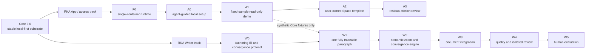

# RKA Ecosystem Roadmap

This is the active, outcome-oriented roadmap for the RKA ecosystem. Detailed
implementation work belongs in repository issues and pull requests; completed
or superseded programs remain available as history.

The active ecosystem has three repositories:

- **RKA Core** — local-first research knowledge, provenance, retrieval,
  integrity, and stable REST/MCP contracts;
- **RKA App** — installation, lifecycle supervision, and optional deployment
  adapters around released Core artifacts; and
- **RKA Writer** — a researcher-controlled authoring graph and convergence
  workbench that consumes Core through public, project-scoped interfaces.

Agentic orchestration remains shelved under
[ADR 0013](docs/adr/0013-shelve-agentic-and-focus-core-writer.md). It is not an
active product, dependency, or roadmap track.

## Current position

| Program | Current state | Next gate |
|---|---|---|
| Core separation E0-E2 | Complete | Preserve the deployed public contract while completing the Core 3.0 release gate. |
| E3 Agentic extraction | Superseded | A new PI decision is required before any reactivation. |
| E4 Writer extraction | Repository and legacy staging baseline complete; product design re-baselined | Complete Writer W0 before implementing a new authoring runtime. |
| E5 Core 3.0 | Audit remediation and release gate active | Close confirmed security, index-recovery, and record-integrity gaps, then verify cross-platform artifacts and non-destructive legacy export. |
| E6 ecosystem integration | Pending | Add reproducible Core-only, Core+App, and Core+Writer compatibility checks after the downstream vertical slices exist. |
| RKA App Foundation 0 | Implementation candidate under review | Merge and pin the first released Core image by digest. |
| RKA Writer | W0 design phase | Ratify the Authoring IR and validate one fully traceable paragraph. |

Core audit-remediation E2 includes
[E2a document parity and conservative legacy adoption](docs/superpowers/specs/2026-09-07-embedding-index-recovery.md).
It now implements [inspection, lifetime admission, backed-up offline transition,
resume and rollback](docs/embedding-inspection.md). Native FastEmbed inference is
isolated in a supervised child. Offline transition queues the existing durable
worker; it does not claim completed inference or deployment. Cross-platform CI
and the E-series acceptance evidence gate the PR merge. This is distinct from
the completed Core-separation E0-E2 program above. I3 is merged in PR #161;
I4-I7 are implemented and locally validated in an isolated integration candidate
(3847 Core tests passed). PR integration and native cross-platform CI remain
pending. R1-R3 remain separate release/security gates.
See [E-series validation and explicit limits](docs/superpowers/plans/2026-09-07-core-e-completion-validation.md).
See [I-series implementation and integration status](docs/superpowers/plans/2026-09-08-core-i-completion-validation.md).

The pre-rebaseline roadmap, including the completed Workbench program, is
preserved in
[`docs/history/rka-roadmap-pre-rebaseline-2026-09-03.md`](docs/history/rka-roadmap-pre-rebaseline-2026-09-03.md).

## Dependency map

RKA App and RKA Writer may progress in parallel after their shared Core
contract is pinned. The public demo is initially a Core demonstration; Writer
does not depend on Hugging Face and must not use the demo as storage for
researcher material.

## Core release and maintenance track

Core remains canonical for projects, journals, literature, decisions,
missions, claims, evidence, experiments, provenance, freshness, retrieval,
integrity, migration, backup, and export.

The current Core gate is:

1. complete the confirmed audit-remediation gates before publishing;
2. publish a verified Core 3.0 release from immutable, cross-platform
   artifacts;
3. preserve the stable public REST/MCP contract and capability discovery;
4. retain the one-way legacy Writer export without switching Writer authority;
5. keep Core usable without App or Writer; and
6. treat new authoring behavior as Writer-owned work.

The [2026-09-05 audit remediation plan](docs/superpowers/plans/2026-09-05-core-audit-remediation-plan.md)
and [hardening design](docs/superpowers/specs/2026-09-05-core-hardening-design.md)
define the current construction sequence: execution/file boundaries, local write
repairs, bounded and recoverable indexing, audited record/currentness semantics,
and release verification. Work uses isolated environments; no production database
cleanup or migration is implied by implementation. App/Writer design may continue,
but deployment must consume a verified Core release rather than an unverified main.

The isolated [file-boundary slice](docs/superpowers/plans/2026-09-05-core-file-boundary-validation.md)
has local Core regression evidence; native cross-platform CI and release gates
remain pending. Path-reading upgrades require [operator-owned input roots](docs/FILE_ACCESS.md).

Core issues after release are prioritized by correctness, security, project
isolation, recovery, retrieval quality, and compatibility. New Writer,
Workbench, desktop, or autonomous-agent behavior does not enter Core.

## Local-first access and trial track

This track is owned by RKA App and consumes released Core artifacts.

| Stage | Outcome | Exit gate |
|---|---|---|
| **F0 — Runtime substrate** | A minimal supervisor runs Core API and worker in one isolated container. | Process failure, shutdown, persistence across container replacement, and non-interference with a live installation are verified. |
| **A0 — Agent-guided local setup** | Codex or Claude guides installation while data and embedding runtime stay on the researcher's machine. | Fresh macOS, Windows, and Linux installs pass health, persistence, MCP, export, and restart read-back. |
| **A1 — Fixed-sample public demo** | A visitor explores retrieval, provenance, decisions, research map, and export against published synthetic data. | No upload, durable user record, secret, or private-data path exists; reset is deterministic. |
| **A2 — User-owned Space template** | A user duplicates a data-free template into an account they administer. | Core version is pinned; ownership, persistence, secrets, cost, backup, export, deletion, and cloud privacy boundaries are documented and verified. |
| **A3 — Residual-friction review** | Decide whether a native desktop application solves a measured remaining problem. | A separate PI decision names the evidence, scope, privacy boundary, and release gate. |

Local deployment remains the recommended path for sensitive, unpublished,
regulated, or contract-restricted research. RKA Project does not operate a
multi-tenant research-data service, personal instances, centralized backups,
required telemetry, or an administrator data plane.

## Writer track

Writer progressively compiles reviewed research knowledge and explicit
researcher decisions into a versioned authoring graph. Public prose is produced
only as a bounded realization of approved sentence intents.

| Stage | Outcome | Exit gate |
|---|---|---|
| **W0 — Authoring IR and Core boundary** | Freeze artifact hierarchy, exact dependency edges, lifecycle/readiness, permissions, semantic patches, source maps, and Core bindings. | RFC and focused ADRs are accepted; schemas and sanitized fixtures represent every invariant. |
| **W1 — One fully traceable paragraph** | Move from one approved paper question through claim, evidence use, narrative move, paragraph contract, sentence intents, term locks, and accepted sentence realizations. | One grounded paragraph is reconstructable; an upstream change marks only affected artifacts stale and never silently rewrites prose. |
| **W2 — Semantic zoom and convergence** | Add decision queue, branch comparison, locking, impact propagation, session recovery, and oscillation detection. | The researcher can converge from paper to sentence scale without losing accepted decisions. |
| **W3 — Document integration** | Add Markdown/LaTeX source maps, stable anchors, Git synchronization, PDF compilation, and conflict-safe reconciliation. | Direct edits and upstream changes cannot silently overwrite accepted text. |
| **W4 — Quality and isolated review** | Add evidence, terminology, claim-scope, numerical, coherence, and reader-facing audits plus explicit reviewer import. | Review stays advisory and isolated from drafting context. |
| **W5 — Human evaluation** | Compare a conventional LLM prompt, the frozen Writer 0.2 skill, and the workbench. | The workbench improves fidelity, convergence, researcher control, and reader quality without hidden semantic changes. |

Hard requirements across all Writer milestones are: zero silent claim changes,
zero silent term changes, zero silent evidence reinterpretations, and zero
silent upstream-triggered rewrites.

## Governance and tracking

- This file records durable sequencing and exit gates.
- Repository issues and pull requests track work in flight.
- RFCs hold proposals under discussion; ADRs hold accepted decisions and link
  to any decision they supersede.
- Each repository maintains its own detailed roadmap and validation evidence.
- Cross-repository compatibility is declared and tested; releases are not
  lockstep.

The current execution plan is
[`docs/superpowers/plans/2026-09-03-rka-ecosystem-active-roadmap.md`](docs/superpowers/plans/2026-09-03-rka-ecosystem-active-roadmap.md).
