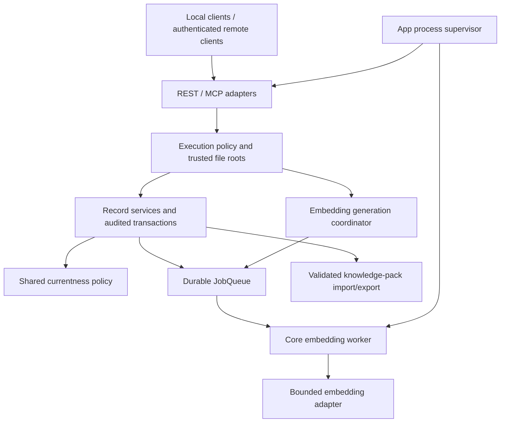

# Core hardening: execution, recovery, and record integrity

- Date: 2026-09-05
- Status: implementation baseline for the approved audit-remediation direction.
- Source baseline: `f8db01b33acc76cfa6f9fff804868c21cd08d58b`.
- Execution plan: [audit remediation](../plans/2026-09-05-core-audit-remediation-plan.md).
- Approval: the PI accepted the audit assessment and requested overall design followed by implementation.
- Delivery scope: staged Core changes; App/Writer remain separate repositories.

## Intent

Make the existing Core safe to upgrade, recoverable after interrupted work, and
consistent about provenance and currentness. Preserve public records and working
local workflows while closing bypasses between REST, MCP, service calls, and workers.
This document fixes the shared boundaries and implementation order. Future API
shapes below are design contracts, not claims about already available operations.

## Component boundaries

Core owns policy enforcement, records, database transactions, vector identity,
index jobs, and recovery commands. App owns starting/stopping processes, isolated
deployment, optional model installation/runtime, and the released image digest.
Writer consumes versioned, project-scoped records and currentness; it cannot
repair Core data by writing Core tables.

## 1. Execution policy and file access

- An operation's effect is determined by its implementation, not its tool name
  or whether it is labeled `query`. Remote policies must cover typed operations,
  legacy tools, REST, and internal dispatch paths consistently.
- An actor is asserted attribution. Authentication and granted permissions are
  separate inputs established by the trusted transport, never by request body
  fields or `X-RKA-Actor` alone.
- Remote exposure remains disabled/unsupported until its permission enforcement
  is verified. Public demo policy permits only approved reads and export of the
  fixed synthetic project; it grants no upload, configuration, host-file access,
  or durable visitor-write capability. A user-owned Space is a separate profile.
- Host files are read by an explicitly configured local connector and transferred
  as bounded bytes. Any retained server-file entry point uses operator-configured
  roots, regular-file checks, bounded reads/enumeration, and symlink containment.
  Request data cannot nominate its own authorization root.
- SPA assets have one resolved immutable root per app instance. Resolving an
  unsafe/outside path must yield a controlled 404, never a filesystem response.
  Existing `/assets` StaticFiles checks and normal SPA navigation remain intact.

### First implementation: hooks

The only executable handler is `brain_notify`. SQL and the scheduled-only MCP
placeholder are unsupported, including stored/imported hooks. One shared handler
policy is used at creation, re-enabling, and execution. Creation/re-enable return
422 with a stable REST error code (MCP preserves its existing API-error tool
failure mapping); stored unsupported hooks produce an error execution
record without interpreting SQL or reporting a fictitious successful tool call.

Legacy handler values remain parseable on reads and pack round trips. No data is
deleted and no schema migration is necessary for this slice. Disabling an old
hook remains possible. Unsupported hooks cannot bypass the policy by changing
actor, being inserted before upgrade, or firing inside journal creation.

## 2. Embedding ownership and recovery

Reuse `services/jobs.py`: it already has bounded attempts, lease tokens,
lease-expiry recovery, and backoff. Extend the existing primitives rather than
creating a second scheduler. The missing integration is backfill/generation work;
the queue's existing per-record lease must not be mistaken for exclusive index
transition ownership.

- The API reconciles configuration and requests work; full corpus inference runs
  outside the API process. Startup stays available in explicitly reported lexical
  mode while indexing is pending or failed.
- A coordinator owns each generation transition. Deduplication includes generation
  and task kind; stale owners cannot write vectors or declare a generation ready.
  Ordinary edit jobs and backfill share per-record write guards and one input codec.
- Leases require renewal for long work or bounded sub-jobs shorter than the lease.
  Heartbeat failure, process loss, cancellation, and attempt exhaustion have
  persistent, inspectable outcomes. No in-memory registry is authoritative.
- Input adaptation defines document/query templates, tokenizer/cap policy, and
  encoding revision. Limit single input, total batch budget, batch count, and
  padding amplification; local inference also has a process memory boundary.
  Truncation is explicit and leaves original research text untouched.
- Changing a document encoding policy changes vector-space identity. Healthy
  same-space rows may be adopted individually after proof; unknown or different
  spaces require transition. Query-only changes retain the existing documented
  no-document-rebuild behavior.
- Completion means coverage and consistency pass, not merely that a cursor ended.
  A failed row is visible; the index cannot claim ready while required rows are absent.

### Offline dimension changes

Core provides inspect/dry-run/rebuild/resume commands backed by the same services.
App stops all peers and invokes the Core command; Core verifies exclusive
maintenance ownership before resizing SQLite virtual tables. The operation records
configuration/generation intent, backs up before mutation, and exposes resumable
progress. Interrupted configuration/schema transitions must reconcile explicitly.
Code rollback and database restore are separate procedures with tested artifacts.

Before this slice ships, freeze the concrete lease/coordinator schema and migration,
CLI wire errors, seven-entity coverage, default resource budget, and supported
old-database fixtures. Update the pack table registry for any new project tables;
runtime jobs are not portable research records.

## 3. Audited record changes and currentness

Record services own atomic validation, mutation, provenance links, and audit events.
Adapters only normalize transport inputs; a direct service call enforces the same
invariants. A mutation's receipt identifies entity/project, before/after revision,
actor, rationale where required, and audit/provenance references. Retry semantics
must distinguish the same request from a conflicting later edit.

- Keep asserted author, original text, and executing actor distinct. Agent
  restatement requires original PI input; source-document ingestion identifies its
  exact source bytes instead. Attribution corrections retain old values, reason,
  and revision. Historical unknown attribution is never reconstructed by guessing.
- Preserve working journal status/bulk updates from #152; lifecycle tightening
  must not reintroduce silent field loss or unsettable status.
- Typed MCP writes are tested through persistence read-back, including optional
  tags/provenance/status and omission versus explicit null. Declared fields must
  reach the final service even through multiple legacy adapters.

### Shared currentness contract

Build one pure policy from stored record signals and reuse it across entity
resolution, search, graph, freshness, maintenance, and MCP projections. Keep
structural invalidation, review warnings, explicit disposition, and scientific
support separate. Establish a truth table before changing storage or ranking.

| Input | Required consequence |
|---|---|
| Superseded/retracted/retired lifecycle or inactive reviewed disposition | Historical retrieval allowed; never reported as current |
| Structural stale flag or new invalidating dependency | Needs review and non-current until explicitly resolved under the contract |
| Yellow review warning without invalidation | Warning preserved; does not by itself fabricate retirement |
| Green/closed alert | Does not override another invalidating signal |
| Reflag after a resolution | Reopen review; retain previous resolution in history |
| Missing dependency or uncertain attribution | Explicit gap/review candidate; no automatic semantic verdict |

Implement #141 on existing migration-030 fields with atomic audit/link updates,
idempotent exact retry, wrong-project rejection, and visible disposition. Route
raw flag-clearing through the audited contract or return a compatibility error.

Directive propagation follows explicitly defined lifecycle dependency edges.
Ordinary references and evidence supporting a decision are not sufficient to
withdraw independent PI instructions. Unlinked similar text becomes a review
candidate only. Live supersede and admin repair share the same impact helper,
with whole-transition atomicity or an explicit recoverable state machine.

## 4. Knowledge-pack integrity

Import proceeds through bounded input staging, original-content validation,
reference resolution, controlled ID remapping, target-hash recomputation,
transactional database import, managed-artifact publication, and final verification.
Failures compensate staged files and return structured issues without silent NULL
substitution. A declared portable-reference registry is checked against actual FKs
and separately enumerates logical/polymorphic references and intentional exclusions.
Hashes establish consistency, not the sender's identity.

## Delivery and validation

1. **Security slices:** first, shared hook handler policy, legacy execution refusal,
   SPA containment, regression tests, and exact compatibility notes. Follow with
   operator-authorized roots and bounded host-file/byte-transfer entry points
   (S2); the first patch does not close those file-access or remote-policy gaps.
2. **Local write repairs:** BibTeX parser/actor and MCP field persistence, each in
   independently reviewable changes.
3. **Index lifecycle:** resource-bound regression fixtures, bounded codec, durable
   coordinator/worker integration, offline rebuild and recovery tests.
4. **Record semantics:** audited attribution, currentness truth table/#141,
   dependency-specific directive propagation/#153, pack and state-machine repairs.
5. **Release:** fresh and historical upgrade matrices, constrained real-backend
   measurements, public-contract snapshots, cross-platform wheels, verified image
   publication and anonymous pull. Remote features either pass their boundary tests
   or are explicitly disabled before release.

All implementation uses a new `codex/` worktree, its own venv and temporary data
directory, synthetic fixtures, and no production endpoints or volumes. Process
tests use ephemeral loopback ports. No automatic production migration, deployment,
historical-record cleanup, or cloud publication is part of building these slices.

## First-slice acceptance

- An unsupported hook cannot be created/re-enabled through service, REST or MCP.
- A pre-existing SQL hook cannot modify another project's record or force a
  journal transaction to commit early; its execution is reported as blocked.
- The MCP placeholder never reports an operation succeeded when it did not run.
- Normal notifications, journal creation, hook inspection and disable remain valid.
- Encoded traversal, outside symlinks, and unsafe path errors never return a file
  outside the static root; valid assets and nested SPA routes still work.
- Core-owned regression tests fail on the pre-fix source and pass after the fix;
  focused integration/contract checks pass without a live server or model.
